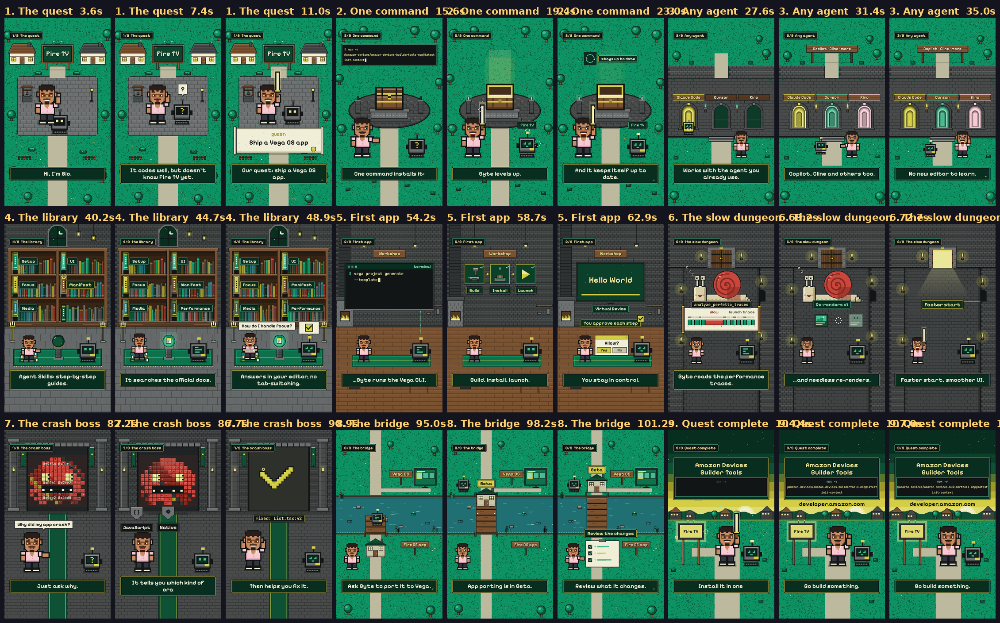
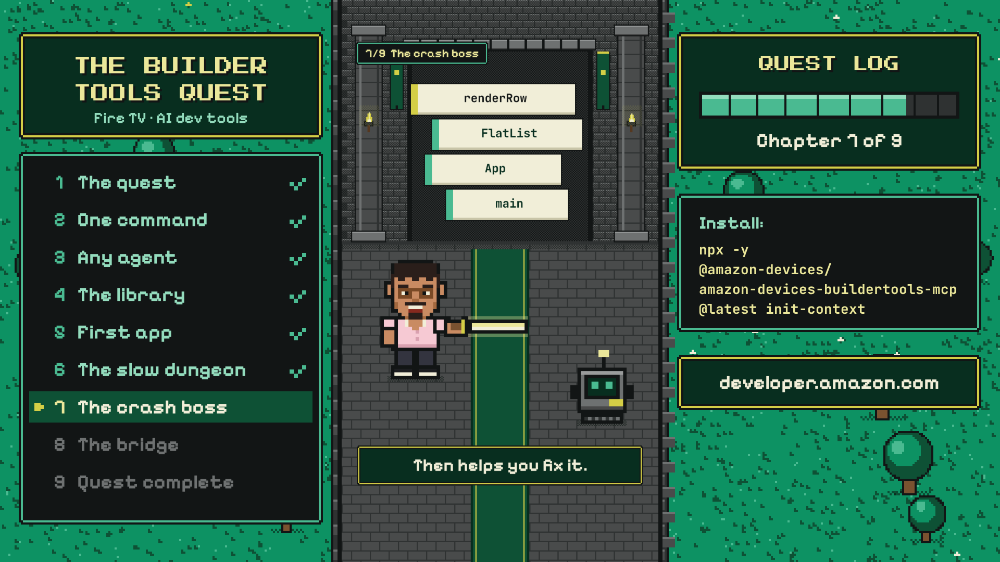

# The Builder Tools Quest

A 1:50 pixel-art explainer about [Amazon Devices Builder Tools](https://developer.amazon.com/apps-and-games/blogs/2026/05/introducing-amazon-builder-tools), the AI-powered toolkit for Fire TV development. Mini Gio and Byte, his AI coding agent, go on a quest: install the tools with one command, learn Vega from the library of Agent Skills, beat the slow-launch dungeon, and slice the crash boss into readable stack frames.

Every frame is drawn in code on an HTML canvas, and the chiptune soundtrack is synthesized in Python. There are no image generators, stock art or audio samples.



## Outputs

| Version | Size | Command |
|---|---|---|
| Vertical, for phones | 1080×1920 | `npm run render` |
| 16:9, film centred with side panels | 1920×1080 | `npm run render:wide` |

Both are 30 fps, 110 seconds. Files land in `out/`.



## Requirements

- Python 3.10+
- Node.js (only for the `npm run` shortcuts; you can run the Python scripts directly)
- ffmpeg
- Chromium for Playwright

```bash
pip install -r requirements.txt
python3 -m playwright install chromium
```

## Render

```bash
npm run render         # audio + frames + mux -> out/builder_tools_quest.mp4
npm run render:wide    # 16:9 cut          -> out/builder_tools_quest_16x9.mp4
```

Or step by step:

```bash
python3 audio.py              # out/audio.wav
python3 render.py             # out/video_only.mp4 (2 headless Chromium workers)
./mux.sh vertical             # out/builder_tools_quest.mp4
```

A full render takes about 3 minutes on 2 CPU cores. `python3 render.py --workers 4` splits the work across more browsers.

## Preview while editing

```bash
python3 snap.py --sheet                 # snaps/contact_sheet.png, 3 frames per chapter
python3 snap.py --ch 7 --n 12           # snaps/ch7_sheet.png, 12 frames of chapter 7
python3 snap.py --only 7 --t 83 88.5    # full-size stills at those seconds
python3 wide_render.py 45 88.5          # 16:9 stills
```

## How it works

- **`kit.js`**: the drawing kit. Palette, pixel primitives, terrain, props, and the sprites for Mini Gio, Byte and the Compile Blade.
- **`film.js`**: the timeline. Chapter boundaries, captions, the chapter tag and the pixel-block wipes. `renderAt(t)` draws any moment of the film.
- **`chapters/ch1.js` … `ch9.js`**: one file per chapter. Each registers `CH[n] = { lo(p, t), hi(c, t) }`:
  - `lo` draws the world on a 270×480 canvas that is scaled ×4 with hard edges, so everything is real chunky pixels.
  - `hi` draws text, code and speech bubbles at full resolution so they stay sharp on a phone.
- **`wide.js`**: the 16:9 composition around the vertical film.
- **`audio.py`**: the chiptune score (pulse, triangle and noise channels) and sound effects, placed on the same 120 BPM grid as the picture.
- **`render.py` / `wide_render.py`**: step through every frame in headless Chromium and pipe the frames to ffmpeg.

Every frame is a pure function of time, so any frame can be rendered on its own and renders can be split across workers.

Timing uses a beat grid: `K.at(bar, beat)` turns a storyboard cue like `42.3` (bar 42, beat 3) into seconds. `STORYBOARD.md` has every chapter's cues, captions, facts and sources. `STYLE.md` has the palette, type sizes and layout rules. `CHAPTER_BRIEF.md` is the brief each chapter was built from.

## Facts and simplifications

The storyboard lists the sources and what the film simplifies. In short:

- Byte stands in for any AI coding agent; Builder Tools is added to your agent, not a separate agent.
- The agent runs Vega CLI commands on your machine and you approve each step.
- App porting from Fire OS to Vega is in Beta.

## Credits

Palette based on [color-hex palette 4125](https://www.color-hex.com/color-palette/4125). Fonts are under the SIL Open Font License (see `fonts/README.md`). All characters and designs are original. Amazon, Fire TV and the named AI agents are trademarks of their owners; this project isn't affiliated with or endorsed by Amazon.
